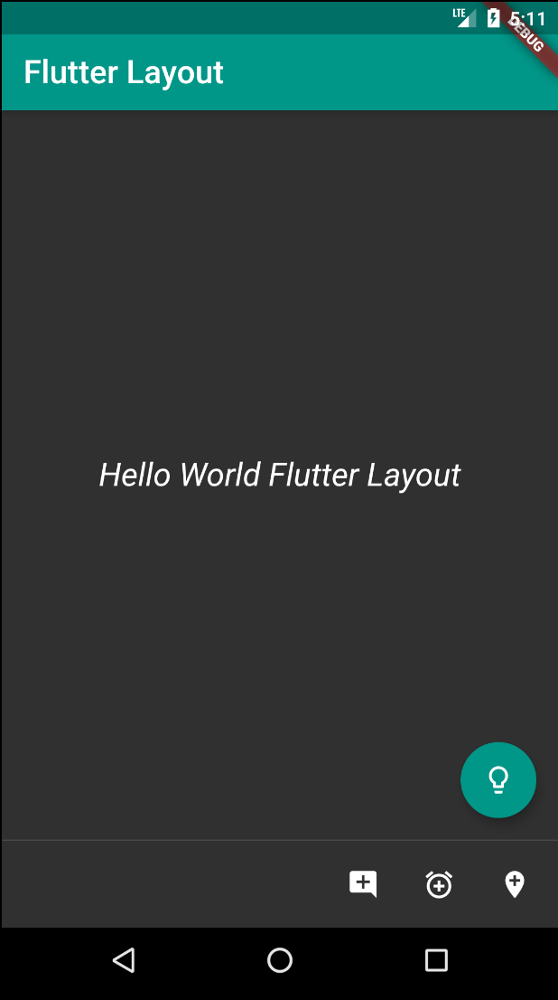
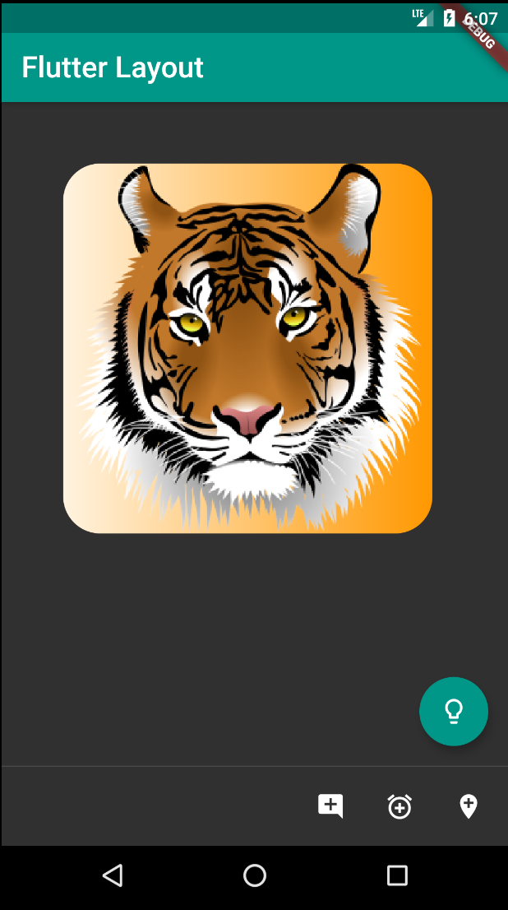

# hello_layout

A hello world app for flutter framework

## Getting Started

This project is a starting point for a Flutter application.

## What I implemented
- working material design layout
- working with scaffold
- working with persistentFooterButtons
- working with containers size, shape, position and transformation
- working with gradient

## Below is the app layout of this flutter hello world app

### working with container

A few resources to get you started if this is your first Flutter project:

- [Lab: Write your first Flutter app](https://flutter.dev/docs/get-started/codelab)
- [Cookbook: Useful Flutter samples](https://flutter.dev/docs/cookbook)